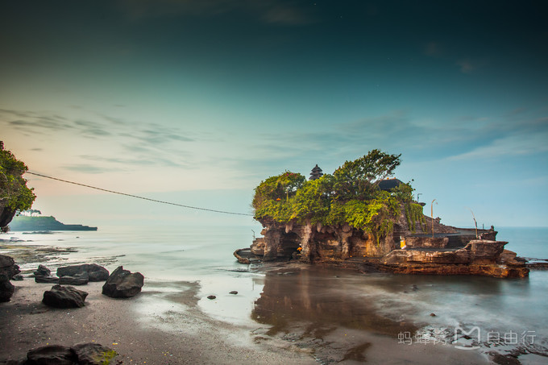
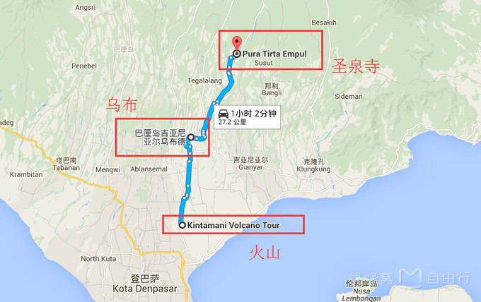

还有一个月要去巴厘岛，我要提前做好攻略

# 基本信息

* 5.28 16:00北京 - 00:45 登巴萨
* 6.3 01:45 登巴萨 - 08:45 北京

卢比汇率 1人民币元=1934.2525印尼卢比

* 酒店 FAVEHOTEL 具体哪个不清楚

### 一些景点

* 巴厘岛最著名神庙——海神庙

海神庙是巴厘岛最重要的海边庙宇之一，始建于16世纪。海神庙坐落在海边一块巨大的岩石上，每逢潮涨之时，岩石被海水包围，整座寺庙与陆地隔绝，孤零零地矗立在海水中，只在落潮时才与陆地相连。每到傍晚18:30左右，日落同寺庙交相辉映，飞溅的浪花拍打岩石，实为壮观，神庙右侧有一突起岩石是拍摄日落和海神庙的绝佳地点。注意非印度教徒不能进去，但是可以在潮退的时候靠近神庙观赏。
门票 30000卢比/人 (15+rmb一个人)

交通：
1. 包车前往，从登巴萨出发约1小时车程，从乌布出发约40分钟的车程
2. 亦可参加一日游的行程，价格相对更便宜，行程安排更合理些

* 世界艺术村——乌布

【乌布（Ubud)】

    是巴厘岛绘画和艺术重镇，蜚声世界的艺术村。这里安祥美丽的田园风光和无处不在的艺术气息令西方人感到新奇，遍布大街小巷的工艺品商店和多个著名的博物馆，通过绘画、雕刻、音乐、舞蹈、纺织、摄影等多种形式，向世人彰显着巴厘岛数百年来的文化传承和艺术底蕴。
    要想深入了解巴厘的人文与艺术特色，在乌布中心步行路径中会经过Nega博物馆，里面展示着各种体验巴厘宗教、文化、历史和自然人文风光的画作与雕刻。另外，千万不要错过乌布皇宫的舞剧表演。表演时在皇宫的露天剧场举行的，伴随着轻快的敲击乐的响起，少女身穿金色织锦的红衣，上面有艳丽的装饰。头戴是有鲜花的金冠，金碧辉煌。舞者扭摆腰臀，睁大的眼眸急速闪动，勾魂摄魄，令人过目难忘。

    Tips：乌布传统市场很大，不过东西类似的很多，建议大家如果要买东西，还是需要花点时间好好逛的，找到一家比较有特色的店其实很难，不过传统市场那种氛围还是很不错的，值得体验一下。

【圣泉寺（Pura Tirta Empul）】

    位于Ubud北边的Tampak Siring，寺庙环绕一处圣泉而建故名。 一千多年来，巴厘岛人认为此庙以及此地两处可供沐浴的地方可供求取健康和财富。圣泉庙建筑模宏大、完整，在这里可以看到巴厘岛所有寺庙的特点，他们相信这里的圣泉是最有神力的。作为一个宗教国家，学校也会定期组织安排学生来这里接受洗礼，即使是游客，你也可以参与其中的祭拜仪式，接受圣水的洗礼。
    Tips：圣泉寺出口处的小市场其实非常值得一逛，比起乌布皇宫的龙蛇混杂，这里的纪念品种类一样不少，而且价格竟然更加实惠。

* 最向往的爱情圣地——情人崖

情人崖是位于巴厘岛西南海岸的一座断崖，又被称为乌鲁瓦图悬崖。因为传说有一对青年男女相爱却受到父母的阻挠，在这里跳海殉情，所以这里又认为是爱情圣地，到巴厘岛的情侣都会在此合照，以期待爱情的美好长久。很多人也会在这里举行婚礼。
乌鲁瓦图也有一座海神庙，位于悬崖之上，面向波涛汹涌的大海。这座海神庙可以入内，但需穿着纱笼。门口可以免费租赁纱笼，看门人还会要求游客系上一条黄色腰带。进入庙宇要遵守参观规定，不要大声喧哗。另外，乌鲁瓦图当地还有许多可爱的猴子，非常机灵调皮，但游客需注意佩戴的饰品以及包和相机的安全。
Tips：
1、此地有很多猴子，戴眼镜、手表的游客需注意安全。
2、玻璃教堂位于情人崖附近的蓝点湾(Blue Point Bay)，外墙为透明的玻璃，站在祭台前就能看到大海。很多人选择在这里举行婚礼，让情人崖和大海见证不渝的爱。
3、这儿的游客很少，比海神庙少很多，门票比较便宜，买完门票会有当地人问你要不要导游，如果选择不要，他们便会提醒你小心猴子。
4、因为里面有寺庙，所以进入的时候需要穿上纱笼（不能露大腿），纱笼是免费提供的，走的时候记得归还就好。
5、下午六点在悬崖之巅上面进行的 kecak 舞表演。此舞蹈是由50个以一块布裹着腰肌的成年男子和男孩组成的合唱团，吟唱着模仿猴群的“恰克，啊，恰克，啊，恰克”走进游客围城的同心圆舞台里。感兴趣的朋友可以来观看一下。

线路推荐：乌鲁瓦图线一日游

10:40-11:40  神鹰广场GWK
神鹰广场位置较高，景色优美，目前规划保护神广场、莲花池广场、金鸟广场、露天剧场、露天市集等区域。游客进入景区内需购买门票（价格为100000卢比/人），除了园区内的雕塑建筑外，大概每隔半小时会有一次传统舞蹈表演。也可以到里面的餐厅吃个茶点，餐厅可以远眺整个片区的风景。
12:00-14:00  梦幻海滩Klapa Club
梦幻海滩主要由著名KLAPA俱乐部和下面的冲浪海滩组成，大家可以进入KLAPA餐厅用餐、享用下午茶或使用著名的无边泳池和更衣室（如打算到无边泳池泡一下的话记得带上泳装）。也可以在海滩租上个太阳伞，躺在沙滩放松一下。提醒大家在晒日光浴同时，请记得在指定时间集中，不然会错过我们的班车哦。相关费用：KLAPA餐厅需要最低消费100000卢比/人才能进入。
Tips：虽然海滩旁边会有冲浪板出租并且有当地人冲浪教练收取学费教游客冲浪，但此处风浪非常大，危险程度较高，且不是正规冲浪学校运营，没有保障安全，不建议大家在这里学冲浪。
14:20-15:50  乌鲁瓦图情人崖
乌鲁瓦图情人崖，一个让人浮想联翩的名字。传说曾经有一对遭到家人反对的恋人在这里跳崖殉情。这个故事吸引了不少新人来此举行婚礼，宣誓自己矢志不渝的爱情。当然，现在吸引游客更多的是因为这里能从悬崖上遥望印度洋那永无休止的波涛，以及乌鲁瓦图神庙的精明建筑文化。进入乌鲁瓦图情人崖的区域一定要记得小心猴子！因为这里的猴子是出了名的当地一霸，所有眼镜、耳环、手机、相机、食物都要放进包了不要拿出来！否则就有可能会被猴子抢走，然后需要向当地人购买水果给猴子才能拿回来，但不能保证拿回来的时候是否已经被孙爷爷弄坏掉了，而且也有机会被抓伤，所以一定要小心！
相关费用：乌鲁瓦图神庙20000卢比/人。

### 体验
* 梦兰岛

    [游艇](http://www.mafengwo.cn/sales/2158231.html?cid=1010402&sourceFrom=zhuti-10460-209)

    [这个也不错](http://www.mafengwo.cn/sales/2163729.html?cid=1010402&sourceFrom=zhuti-10460-209)

* 阿勇河漂流

    [套餐一](http://www.mafengwo.cn/sales/2153187.html?cid=1010402&sourceFrom=zhuti-10460-209)

* 野生动物园
    [动物园](http://www.mafengwo.cn/sales/2136410.html?cid=1010402&sourceFrom=zhuti-10460-209)

* 特色SPA

    【知名度最高】巴厘岛Four Seasons四季酒店-巴厘式SPA
    金巴兰四季的SPA也是获奖无数的常胜军，在2003年出版的《Travel ＆ Leisure》杂志中，《金巴兰四季度假村》的SPA无论在整体环境还是疗程评价上都是世界第一，许多国际名人，像是名模辛蒂克劳馥（Cindy Crawford）到巴厘岛都不会错过到这里享受一趟顶级的SPA假期。

    【最受欢迎】金巴兰蝴蝶酒店欧舒丹-L’OCCITANE SPA
    欧舒丹的BAMBOO（竹屋） SPA是L’OCCITANE（欧舒丹）在巴厘岛开的第二家SPA中心。设在巴厘岛KupuKupu Jimbaran 度假酒店内，相对于乌布的分店，这家的地理位置更方便大部分在南部地区活动的客人前往。采用欧舒丹高端身体养护系列，SPA 的每间治疗室都由竹子装饰，独特的设计感和氛围让人身心完全放松，可以在竹子所营造的独特氛围中享受岛上专业治疗师提供的SPA 服务。
    选择Tips：

    巴厘岛各级别的高性价SPA众多，可根据个人的行程时间、酒店区域和级别需求选择。

### 吃
印尼巴厘的口味不知道是否符合你的胃口，但是这里新鲜的水果相信一定能让你过足瘾，无论在稻田旁的小餐馆还是乌布商业区内的特色餐厅都可以点上一杯新鲜果汁，很多水果的口味可供选择，既健康又美味。
岛上的啤酒最出名的是 “Bintang”，专属于巴厘岛的啤酒，在巴厘岛随时可见这个商标。米酒和果酒的话，建议品尝巴厘岛的Hatten玫瑰红酒，还有Tuak棕榈甜酒(由椰子棕榈花汁液制成)和Brem(用黑糯米和椰汁发酵而成)。最受外国观光客欢迎的是Arak，一种无色、无糖的酒精饮料，取Brem或Tuak蒸馏制成，通常加冰块饮用。上述饮料只要不混合饮用，隔天绝不会有宿醉现象，因为其酒精含量只有5％，女生也可放胆一试。
一定要到金巴兰Jimbaran Beach海鲜大排档吃一次晚餐，可以在海滩上烤大龙虾、看日落。天黑后看远处飞机起降。但大排档的电子秤大都不准。可带上一小瓶矿泉水先帮助校秤。
印尼菜肴大量使用椰浆、胡椒、丁香、豆蔻、咖喱等香料调味，餐桌上还常备辣椒酱，浓重的口味很容易令品尝过的人得出不同的看法，所以是不是好吃还要自己尝试。

特色美食：
脏鸭餐
脏鸭套餐极具巴厘特色，翠绿的酱碟，色彩鲜亮的原只烤鸭，再以绿色的青柠片和鲜红的西瓜片作拌碟，整个构图颜色之丰，令人有惊艳之感。最知名的两家品尝脏鸭餐的餐厅都在乌布，分别是Laka leke或是Bebek Bengil。

# 行程安排

    按照一天去景区，一天游玩体验的方式进行安排，中间美食随时机安排
=========
`5.29` 情人崖(0.5小时) → 神鹰广场(1小时) → 海神庙(2小时)

`5.30` 漂流 spa

`5.31` 圣泉寺(1.5小时) → 德格拉郎梯田(1小时) → 乌布皇宫(0.5小时) → 乌布市场(3小时)

`6.1` 梦兰岛

`6.2` 动物园 或 自由

=====
6.3 早晨到北京

巴厘岛的玩法大多千篇一律，因其盛名也通常被国人选做境外海岛游的第一站，自然是要提前做好功课的。要想充分享受海岛风情，度过一个美好假期，腐败是必不可少的。花费主要取决于住和行，大概是每人10000多元人民币。如果想偷懒又不想加入旅行团，不妨参考下这个常规线路：
D1：机场——库塔海滩(Kuta Beach)
D2：海神庙(Tanah Lot)——圣猴森林公园(Sacred Monkey Forest Sanctuary)——京打马尼(Kintamani)——圣泉寺(Tirta Empul)——象窟(Elephant Cave)——金巴兰海滩(Jimbaran)
D3：阿勇河漂流(Ayung White River Rafting)——乌布(Ubud)
D4：乘爱之船出海——努沙佩尼达岛(Nusa Penida)——努沙杜瓦(Nusa Dua)
D5：库塔海滩(Kuta Beach)——返程
具体行程
D1：抵达巴厘机场，办理落地签证入境。如预约包车来接，通常会献上巴厘岛的鸡蛋花。入住酒店后稍作休息，不妨四处走走，感受巴厘气息（建议提前在国内预订好后几日的一日游或者包车服务）。下午漫步库塔海滩，逛街购物，在繁华闹市共享晚餐。
D2：早餐后去往海神庙，参观圣猴森林公园，北上到京打马尼眺望火山，并在此用午餐，返程的路上可参观圣泉寺和象窟，并在德格拉朗的手工艺品店停留购物。傍晚驱车到金巴兰海滩聆听海浪，享受烛光大餐。
D3：预订好的漂流公司会到酒店接你前往阿勇河漂流，中途观看巴伦舞。下午在乌布地区停留，参观乌布皇宫，逛逛街边的画廊和小作坊，晚餐品尝脏鸭餐厅的美味。之后去做个SPA，放松调养。
D4：这一天你可以选择乘坐爱之船出海，前往努沙佩尼达岛(Nusa Penida)潜水；或是在库塔和努沙杜瓦海边参加水上运动，尽情挥洒激情。晚饭后可以在酒店做个SPA。
D5：睡个懒觉酒店退房，如果时间充裕，再去逛逛库塔海滩和闹市区，最后淘些旅游纪念品回去。

### 货币兑换

在国内办好华夏银行储蓄卡，到那边后直接用ATM机提款就可以了，银行直接用人民币结算，不用担心汇率问题，而且华夏银行在境外每天首笔提款是免手续费的，很方便。我们这次去巴厘岛就是，和老公每人办了一张华夏卡，出发前每张卡存了5千元进去，到登巴萨机场后，在机场提了2500000卢比，人民币1172.25元；第二天又在库塔海滩附近的ATM机各提了2500000卢比，人民币是1174.25元，都是免手续费，提完用手机银行查一下实际提了多少人民币就知道当天汇率了，方便快捷又安全。我们一共提了7500000卢比，在巴厘岛7天，除去预付的酒店费，全部用现金支付，足够用，也没有找兑换点换过钱，带去的美金也没有花。提醒一下，当地的ATM机每次最大提款金额是2500000卢比，如果你要一次提5000000卢比，就要分开两次提，所以你最好办两张卡，这样可以省手续费。希望对你有帮助。

## reference

[玩遍这些才算来过巴厘岛](http://www.mafengwo.cn/gonglve/ziyouxing/209.html)

[巴厘岛5日玩法](http://www.mafengwo.cn/mdd/cityroute/10460_311.html)

[巴厘岛游有哪些坑？如何防被坑？](http://www.mafengwo.cn/wenda/detail-7906701.html)