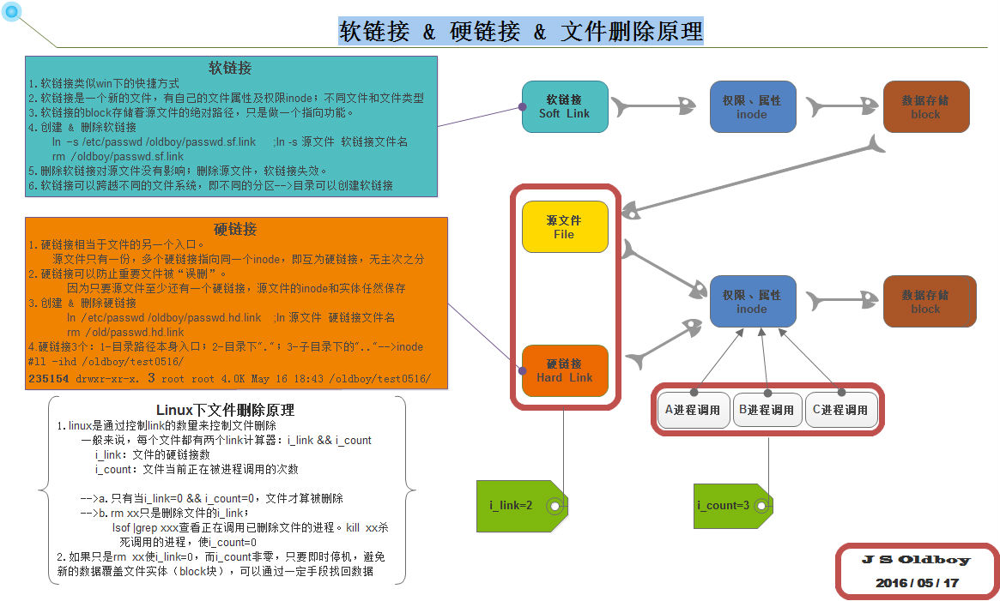

#Linux下查看文件stat到ln探究

`Linux` `file_system` `stat` `ln`

今天使用node的fs.stat查看文件内容的时候看到有个nlink，感到好奇，想是不是能用这个标志区分文件/（非）空文件夹，于是查了一下这个nlink是什么。
对比一下linux 系统命令stat 
```
> stat index.js 
  File: ‘index.js’
  Size: 349       	Blocks: 8          IO Block: 4096   regular file
Device: 808h/2056d	Inode: 4094280     Links: 1
Access: (0664/-rw-rw-r--)  Uid: ( 1000/wsc)   Gid: ( 1000/wsc)
Access: 2016-11-29 11:16:31.236375531 +0800
Modify: 2016-11-29 11:16:29.972375553 +0800
Change: 2016-11-29 11:16:29.972375553 +0800

//fs.stat返回
{ dev: 2056,
  mode: 33204,
  nlink: 1,
  uid: 1000,
  gid: 1000,
  rdev: 0,
  blksize: 4096,
  ino: 4094280,
  size: 349,
  blocks: 8,
  atime: Tue Nov 29 2016 11:16:31 GMT+0800 (CST),
  mtime: Tue Nov 29 2016 11:16:29 GMT+0800 (CST),
  ctime: Tue Nov 29 2016 11:16:29 GMT+0800 (CST),
  birthtime: Tue Nov 29 2016 11:16:29 GMT+0800 (CST) }
```
nlink就是stat命令返回的Links（fs.stat返回比stat还多了个创建日期？），
stat返回中直接返回了文件类型 `regular file` `directory`
查了stat的manpage，源码注释是这样的
```
           struct stat {
               dev_t     st_dev;         /* ID of device containing file */
               ino_t     st_ino;         /* inode number */
               mode_t    st_mode;        /* file type and mode */
               nlink_t   st_nlink;       /* number of hard links */
               uid_t     st_uid;         /* user ID of owner */
               gid_t     st_gid;         /* group ID of owner */
               dev_t     st_rdev;        /* device ID (if special file) */
               off_t     st_size;        /* total size, in bytes */
               blksize_t st_blksize;     /* blocksize for filesystem I/O */
               blkcnt_t  st_blocks;      /* number of 512B blocks allocated */

               /* Since Linux 2.6, the kernel supports nanosecond
                  precision for the following timestamp fields.
                  For the details before Linux 2.6, see NOTES. */

               struct timespec st_atim;  /* time of last access */
               struct timespec st_mtim;  /* time of last modification */
               struct timespec st_ctim;  /* time of last status change */

           #define st_atime st_atim.tv_sec      /* Backward compatibility */
           #define st_mtime st_mtim.tv_sec
           #define st_ctime st_ctim.tv_sec
           };
```
原来是硬链接数
好吧，那硬链接数是什么？和软链接有什么区别？和复制有什么区别？

我拿了个40M的大文件进行了一下测试
```
➜ /home/wsc/workspace/node/wsc_copy/test >l
total 40M
drwxrwxr-x 2 wsc wsc 4.0K 11月 29 12:09 .
drwxrwxr-x 3 wsc wsc 4.0K 11月 29 12:09 ..
-rw-r--r-- 1 wsc wsc  40M 11月 29 12:07 data.json
➜ /home/wsc/workspace/node/wsc_copy/test >ln data.json data.json_ln
➜ /home/wsc/workspace/node/wsc_copy/test >ln -s data.json data.json_lns
➜ /home/wsc/workspace/node/wsc_copy/test >l
total 80M
drwxrwxr-x 2 wsc wsc 4.0K 11月 29 12:10 .
drwxrwxr-x 3 wsc wsc 4.0K 11月 29 12:09 ..
-rw-r--r-- 2 wsc wsc  40M 11月 29 12:07 data.json
-rw-r--r-- 2 wsc wsc  40M 11月 29 12:07 data.json_ln
lrwxrwxrwx 1 wsc wsc    9 11月 29 12:10 data.json_lns -> data.json
➜ /home/wsc/workspace/node/wsc_copy/test >du -h --max-depth=1 .
40M	.
➜ /home/wsc/workspace/node/wsc_copy/test >stat data.json
  File: ‘data.json’
  Size: 41546770  	Blocks: 81152      IO Block: 4096   regular file
Device: 808h/2056d	Inode: 4094283     Links: 2
Access: (0644/-rw-r--r--)  Uid: ( 1000/wsc)   Gid: ( 1000/wsc)
Access: 2016-11-29 12:07:55.928320290 +0800
Modify: 2016-11-29 12:07:55.968320289 +0800
Change: 2016-11-29 12:09:53.024318193 +0800
 Birth: -
➜ /home/wsc/workspace/node/wsc_copy/test >stat data.json_ln
  File: ‘data.json_ln’
  Size: 41546770  	Blocks: 81152      IO Block: 4096   regular file
Device: 808h/2056d	Inode: 4094283     Links: 2
Access: (0644/-rw-r--r--)  Uid: ( 1000/wsc)   Gid: ( 1000/wsc)
Access: 2016-11-29 12:07:55.928320290 +0800
Modify: 2016-11-29 12:07:55.968320289 +0800
Change: 2016-11-29 12:09:53.024318193 +0800
 Birth: -
➜ /home/wsc/workspace/node/wsc_copy/test >stat data.json_lns
  File: ‘data.json_lns’ -> ‘data.json’
  Size: 9         	Blocks: 0          IO Block: 4096   symbolic link
Device: 808h/2056d	Inode: 4738027     Links: 1
Access: (0777/lrwxrwxrwx)  Uid: ( 1000/wsc)   Gid: ( 1000/wsc)
Access: 2016-11-29 12:10:10.252317884 +0800
Modify: 2016-11-29 12:10:10.152317886 +0800
Change: 2016-11-29 12:10:10.152317886 +0800
 Birth: -
➜ /home/wsc/workspace/node/wsc_copy/test >cp data.json data.json_cp
➜ /home/wsc/workspace/node/wsc_copy/test >l
total 119M
drwxrwxr-x 2 wsc wsc 4.0K 11月 29 12:11 .
drwxrwxr-x 3 wsc wsc 4.0K 11月 29 12:09 ..
-rw-r--r-- 2 wsc wsc  40M 11月 29 12:07 data.json
-rw-r--r-- 1 wsc wsc  40M 11月 29 12:11 data.json_cp
-rw-r--r-- 2 wsc wsc  40M 11月 29 12:07 data.json_ln
lrwxrwxrwx 1 wsc wsc    9 11月 29 12:10 data.json_lns -> data.json
➜ /home/wsc/workspace/node/wsc_copy/test >du -h --max-depth=1 .
80M	.
➜ /home/wsc/workspace/node/wsc_copy/test >rm data.json
➜ /home/wsc/workspace/node/wsc_copy/test >ll
total 81152
-rw-r--r-- 1 wsc wsc 41546770 11月 29 12:11 data.json_cp
-rw-r--r-- 1 wsc wsc 41546770 11月 29 12:07 data.json_ln
lrwxrwxrwx 1 wsc wsc        9 11月 29 12:10 data.json_lns -> data.json(unreachable)

```

好了，现在很清晰了，cp/ln/ln -s 的区别

* cp开辟了一块新的存储空间，两个文件Inode并不一样，磁盘空间占据两个40M；
* ln（硬链接）创建了一个同一区块的“引用”，两个Inode一样，磁盘空间只占据一个40M，只要留有任一备份就可以访问该块磁盘空间。
* ln -s（软链接）没有大小(9B)，相当于一个windows下的快捷方式，相当于一个路径映射，原文件删除后目标不可访问。

细心点还发现一个问题，就是`ll`命令查看到的当前路径total 大小是算上硬链接的size，并不是真正所占磁盘空间大小。

回来，结论就是，nlink（Links）数量不能说明文件类型

过程中找到下面一个文章，讲链接和删除指尖的关系。




Lniux下控制文件真正被删除的计数器

Linux是link的数量来控制文件删除的。只有当一个文件不存在任何link的时候，这个文件才会被删除。一般来讲，每个文件都有两个link计数器：i_count和i_link

i_count的意义是当前文件使用者（或被调用）的数量
当一个文件被某一个进程引用时，对应的这个值就会增加
i_nlink的意义是介质连接的数量（硬链接的数量）
当创建文件的硬链接的时候，这个值就会增加
可以理解为i_count是内存引用计数器，i_nlink是硬盘的引用计数器

rm命令原理

对于删除命令rm而言，实际上就是减少磁盘引用计数i_nlink。

Q：如果一个文件正在被某个进程调用，而用户却执行rm把文件删除了，那么会出现什么结果？当用户执行rm删除文件后，再执行ls或其他文件管理命令，无法再找到这个文件了，但是调用这个删除的文件的进程却在继续正常执行，依然能够从文件中正确的读取及写入内容，这又是为什么呢？

A：rm操作只是将文件的i_nlink减少了，如果没有其它的链接i_nlink就为0了。但是由于该文件依然被进程引用，因此，此时文件对应的i_count并不为0，所以执行rm操作，系统并没有真正的删除这个文件，只有当i_nlink和i_count都为0的时候，这个文件才会被真正的删除。也就是说，必须要解除该进程对该文件的调用，才能真正的删除。

Q：当文件没有被调用，执行了rm操作之后，还能找回被删除的文件吗？

A：rm操作只是将文件的i_nlink减少了，或者说置为0，实际上就是将inode的链接删除了，此时，并没有删除文件的实体（block数据块），此时，如果及时停止机器工作，数据是可以找回的，如果继续写入数据，那么新数据可能会被分配到被删除的数据的block数据块，文件就被真正的回收了。

实际遇到的问题

Q：web服务器磁盘空间不够了，删除了所有无用日志还是显示磁盘空间不足，但是du -sh发现磁盘空间的占用率很小，这是为什么呢？是什么导致磁盘空间不足？

A：删除命令只是删除了文件的一个i_nlink,但是其他进程正在使用这些log文件，apache或tomat,重启这些服务就好啦！

[link](http://www.cnblogs.com/cherishry/p/5886069.html)